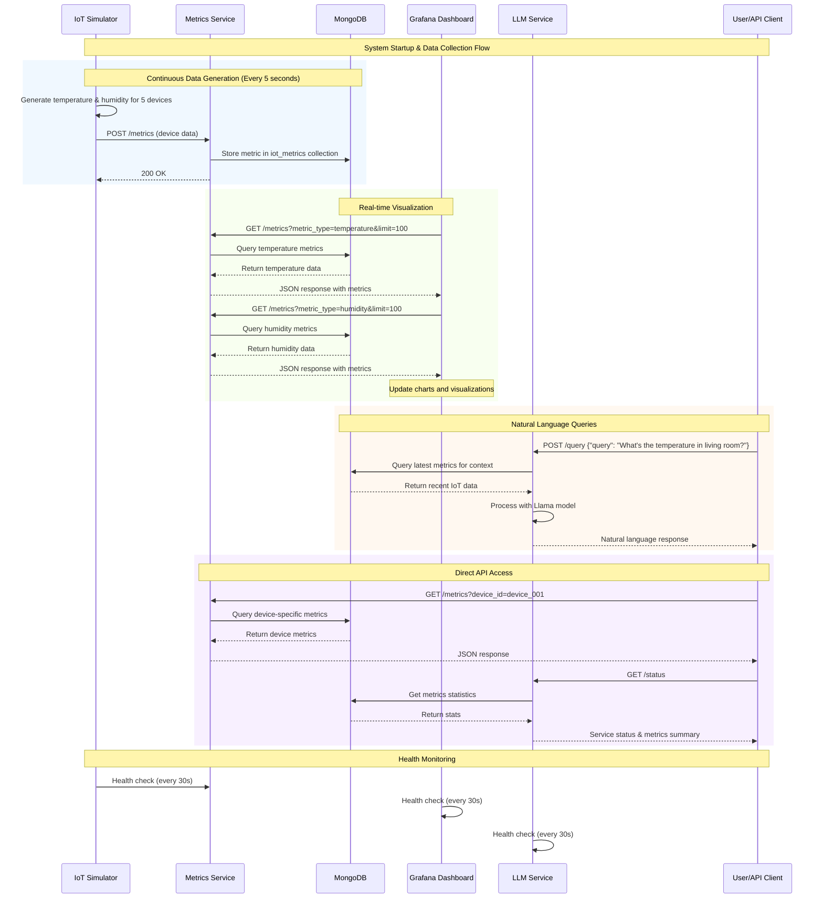
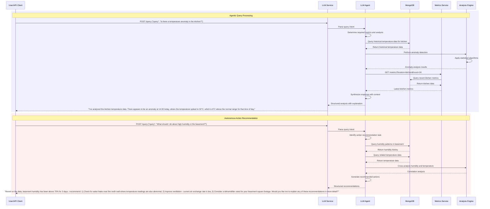
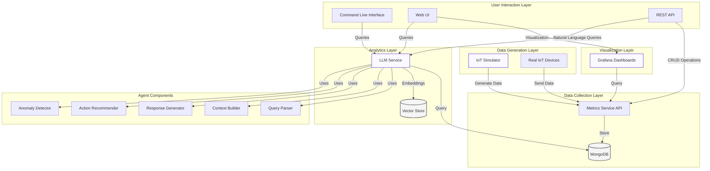
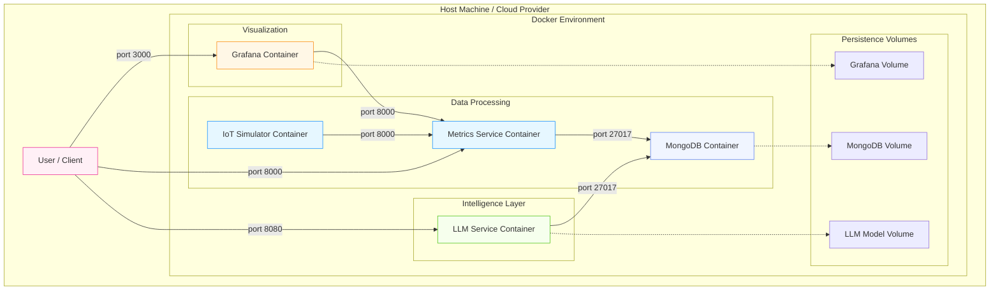

# Agentic IoT Observability Project

This project implements a complete observability solution for IoT devices, collecting temperature and humidity metrics, storing them in MongoDB, visualizing them in Grafana, and enabling natural language queries through an LLM (Llama) service.

## System Architecture

The system consists of the following components:

- **IoT Simulator**: Generates simulated temperature and humidity metrics from virtual IoT devices
- **Metrics Service**: REST API service that collects and stores metrics in MongoDB
- **MongoDB**: Database for storing time-series metrics data
- **LLM Service**: API service that uses Llama model to answer natural language queries about the IoT metrics
- **Grafana**: Visualization dashboard for metrics monitoring

All components are containerized and orchestrated using Docker Compose.

### Data Flow Sequence Diagram



### Agentic LLM Workflow Sequence Diagram



### Component Diagram



### Deployment Diagram



### Component Interactions

1. **Data Generation**: IoT Simulator continuously generates temperature and humidity metrics for 5 virtual devices
2. **Data Storage**: Metrics Service receives and stores data in MongoDB with proper indexing
3. **Visualization**: Grafana queries the Metrics Service API to display real-time charts and dashboards
4. **AI Queries**: LLM Service processes natural language queries by retrieving context from MongoDB and using the Llama model
5. **Health Monitoring**: All services include health checks for reliability and monitoring

## Prerequisites

- Docker and Docker Compose
- At least 8GB of RAM (for running the Llama model)
- Internet connection (for downloading Docker images and the Llama model)

## Getting Started

1. Clone this repository:
   ```bash
   git clone <repository-url>
   cd iot-observability-aiops
   ```

2. Start the system:
   ```bash
   docker compose up -d
   ```

3. Access the services:
   - Grafana: http://localhost:3000 (username: admin, password: admin)
   - Metrics Service API: http://localhost:8000
   - LLM Service API: http://localhost:8080

## Using the LLM Service

The LLM service allows you to query IoT metrics using natural language. Example queries:

- What's the current temperature in the living room?
- Show me the humidity trends in the kitchen for the last hour
- Which room is the hottest right now?
- What's the average temperature across all sensors?

### Production Mode (Docker)

Send queries to the LLM service API endpoint:

```bash
curl -X POST http://localhost:8080/query \
  -H "Content-Type: application/json" \
  -d '{"query": "What is the current temperature in the living room?"}'
```

### Development Mode (Local)

For local development with hot reload and GPU acceleration:

```bash
# Navigate to LLM service directory
cd llm_service

# Run the development server (requires TinyLlama model)
python3 run_dev.py
```

The development server will:
- Start on port 8082 (to avoid conflicts with containerized service)
- Enable hot reload for code changes
- Use local MongoDB connection (mongodb://localhost:27017/)
- Automatically detect and use Metal GPU acceleration (on macOS)
- Load the TinyLlama model from `llm_service/models/`

Access the development API at:
- API: http://localhost:8082
- Documentation: http://localhost:8082/docs
- Health check: http://localhost:8082/health

## Project Structure

```
.
├── docker-compose.yml       # Docker Compose configuration
├── iot_simulator/           # IoT device simulator
│   ├── Dockerfile           # Docker configuration for simulator
│   ├── requirements.txt     # Python dependencies
│   └── simulator.py         # Simulator implementation
├── metrics_service/         # Metrics collection service
│   ├── Dockerfile           # Docker configuration for metrics service
│   ├── app.py               # FastAPI implementation
│   └── requirements.txt     # Python dependencies
├── llm_service/             # LLM service for natural language queries
│   ├── Dockerfile           # Docker configuration for LLM service
│   ├── app.py               # FastAPI implementation
│   ├── entrypoint.sh        # Script to download the Llama model
│   └── requirements.txt     # Python dependencies
└── grafana/                 # Grafana configuration
    ├── dashboards/          # Pre-built dashboards
    └── provisioning/        # Provisioning configuration
        ├── dashboards/      # Dashboard provisioning
        └── datasources/     # Data source provisioning
```

## Customization

### Modifying Simulation Parameters

Edit environment variables in `docker-compose.yml` to change:
- `SIMULATION_INTERVAL`: Time between data points (seconds)
- Add more virtual devices by editing `simulator.py`

### Adding New Metrics

1. Update `simulator.py` to generate new metric types
2. Modify `metrics_service/app.py` to handle the new metric types
3. Update Grafana dashboards to visualize the new metrics

### Changing LLM Model

1. Update `MODEL_PATH` environment variable in `docker-compose.yml`
2. Modify `llm_service/entrypoint.sh` to download the desired model

## License

MIT
